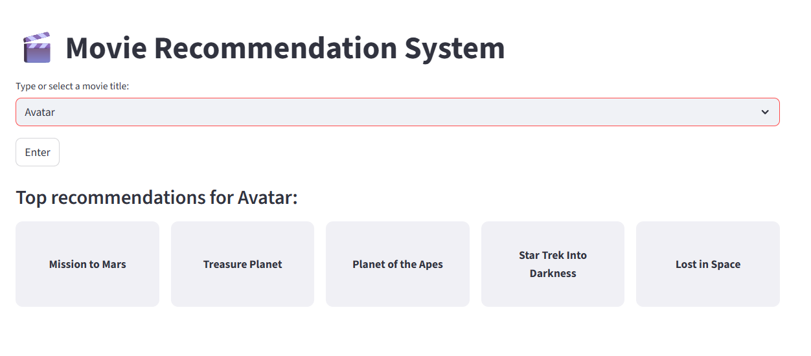

# 🎬 Movie Recommendation System using Streamlit

A modern and fully optimized **Streamlit web application** that recommends movies based on your input using **cosine similarity** on movie features. It includes **fuzzy matching for typos**, **real-time suggestions**, and a clean **landscape UI layout**.

---

## 📂 Dataset Used

- **Source**: TMDB 5000 Movies Dataset  

- **Columns**:
  - `id`, `title`, `overview`, `genres`, `keywords`, `cast`, `crew` (preprocessed to form content-based features)

> Dataset Source: [TMDB Kaggle Dataset](https://www.kaggle.com/datasets/tmdb/tmdb-movie-metadata)

---

## 💡 Features

✅ Real-time movie search with **auto-suggestions**  
✅ Typo handling using **fuzzy matching** (`fuzzywuzzy`)  
✅ **Top 5 similar movies** displayed dynamically  
✅ Random default movie and recommendations on app load  
✅ Responsive UI with clean **horizontal recommendation layout**  
✅ **Error handling** for missing/invalid inputs  
✅ Modern design with **input+enter+suggestion+action** support  

---

## 🧰 Tech Stack

- **Python 3.13.3**
- **Pandas**, **NumPy**
- **Scikit-learn** (`TfidfVectorizer`, `cosine_similarity`)
- **FuzzyWuzzy** for typo correction
- **Streamlit** for frontend

---

## 🗂️ Project Structure

```txt
📁 movie-recommender-app/
├── app.py                    # Main Streamlit app
├── data                      # dataset
├── recommend_pipeline.py            # Core recommendation logic
├── requirements.txt          # Python dependencies
└── README.md                 # Project documentation

```

---

## 🚀 How to Run the App

### 1️⃣ Clone the Repository

```bash
git clone https://github.com/
cd movie-recommender-streamlit-app
```

### 2️⃣ Install Dependencies

```bash
pip install -r requirements.txt
```

### 3️⃣ Run Streamlit App

```bash
streamlit run app.py
```

The app will open in your browser at `http://localhost:8501/`.

---

## 🧪 Example Usage

- Type part of a movie name (e.g., `misi` → auto-suggests `Mission to Mars`)
- Select or hit **Enter** → instantly shows **top 5 recommended movies**
- Handles misspelled inputs with suggestions: `Mistion to Mars` → `Mission to Mars`

---

## 🔐 Requirements

```txt
streamlit
pandas
scikit-learn
numpy
fuzzywuzzy
python-Levenshtein
```

> Use `pip install -r requirements.txt` to install all.

---

## ✨ Screenshots



---

## 👤 Author

> Athar Shaikh
---

## 📄 License

This project is open-source and free to use under the [MIT License](LICENSE).

---

## 🧠 Future Improvements

- Add user ratings & collaborative filtering
- Enable real movie posters via TMDB API
- Deploy on Streamlit Cloud or HuggingFace Spaces

---

## ⭐ Support

If you like this project, give it a ⭐ on GitHub and feel free to fork or contribute!
